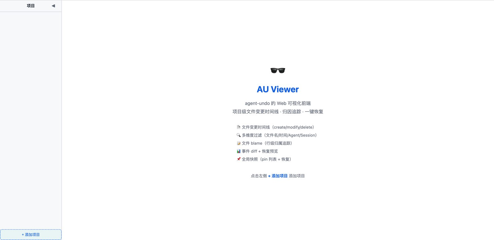
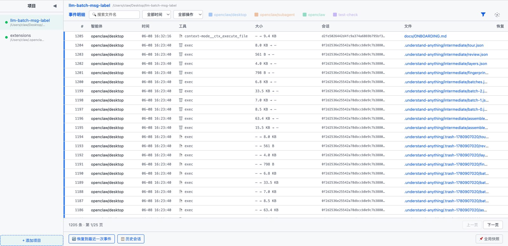
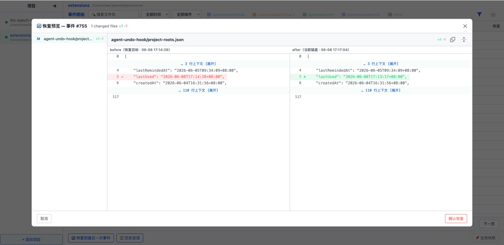

<p align="center">
  
</p>

# agent-undo (`au`) — 中文版

[English](README_en.md)

> [peaktwilight/agent-undo](https://github.com/peaktwilight/agent-undo) v0.0.4 的 fork

## 介绍

agent-undo（`au`）是本地优先的 AI 编码回滚工具，快照每次文件写入，一键撤销任意 session。

本 fork 在上游基础上增加了以下功能：

- **[v0.0.4.5]** `au revert --pin` 恢复预览修复：跳过 daemon 未跟踪删除的文件，预览只显示真实需要恢复的文件
- **[v0.0.4.4]** sessions 表新增 `prompt_output` 列；`au session end` 新增 `--metadata` 参数；metadata 列使用 JSON merge
- **[v0.0.4.3]** 新增 `au revert` 命令：带 diff 预览 + 确认的安全恢复
- **[v0.0.4.2]** 文件删除事件归因修复，不再硬编码 `"unknown"`
- **[v0.0.4.1]** hook stdin 支持自定义 `agent` 字段，不再硬编码 `"claude-code"`

完整文档见上游 [README_en.md](README_en.md)。

## 完整工具链使用

Agent Undo 分三层使用，层层递进，强烈推荐三层都配置：

- **1️⃣ au CLI** — 基础层，文件跟踪与回撤的命令行工具
- **2️⃣ OpenClaw Hook** — 自动层，Agent 编辑时自动归因，无需手动
- **3️⃣ au-viewer Skill** — 可视化层，浏览器浏览时间线 + 一键回滚

### 1️⃣ au CLI — 命令行

基础能力，独立于任何 Agent 框架：

| 命令 | 说明 |
|------|------|
| `au init --install-hooks` | 初始化项目 |
| `au serve --daemon` | 后台实时快照 |
| `au session start/end` | 会话管理 |
| `au hook pre/post` | 归因窗口 |
| `au log / blame / diff` | 查询 |
| `au oops` | 撤销最近一波 |
| `au revert` | 指定回撤（本 fork 新增） |

### 2️⃣ OpenClaw Hook — 自动归因

在 OpenClaw 中启用 `agent-undo-hook` 插件，Agent 编辑文件时自动归因，无需手动执行 `au hook pre/post`：

- Agent 开始编辑前 → hook 自动调 `au hook pre`
- Agent 编辑结束 → hook 自动调 `au hook post`

亮点：

- **轮次级归因** — 一轮对话 = 一个 au session，该轮所有文件修改统一归因
- **自动识别项目** — 写入时自动定位项目根，未初始化项目启发式提醒
- **项目隔离** — 跨项目修改时独立开 session，互不干扰
- **渠道类型归因** — feishu / cron / subagent 等渠道自动写入 agent 字段

安装：[sadjjk/public-agent-skills-plugins/plugins/agent-undo](https://github.com/sadjjk/public-agent-skills-plugins/tree/main/plugins/agent-undo)

### 3️⃣ au-viewer Skill — 可视化查看与回滚

OpenClaw Skill，在浏览器中浏览项目文件变更时间线 + 一键回滚：

- **触发**：`au-viewer <项目路径>` 或 `au-viewer`
- **功能**：事件时间线、diff 查看、会话级/事件级回滚、文件 blame、全局快照、多主题切换

| | |
|---|---|
|  <br/> **初始页** — 项目选择 + 快速入口 |  <br/> **会话明细** — Session 级别操作记录 |
|  <br/> **事件明细** — 单次文件变更详情 |  <br/> **恢复预览** — 左右 diff 对比 + 一键回滚 |

安装：[sadjjk/public-agent-skills-plugins/skills/au-viewer](https://github.com/sadjjk/public-agent-skills-plugins/tree/main/skills/au-viewer)

## CLI 安装

**方式一：下载预编译二进制**

从 [Releases](../../releases) 下载对应平台的 `au` 二进制，放到 PATH 下即可（如 `~/.local/bin/`）。下载后需加执行权限：`chmod +x ~/.local/bin/au`

**方式二：自行编译**

需要 Rust 工具链（[rustup](https://rustup.rs)）：

```sh
git clone https://github.com/sadjjk/agent-undo.git
cd agent-undo
cargo build --release
cp target/release/au ~/.local/bin/au
```

## 修改记录

### v0.0.4.5

**背景**：`au revert --json --pin` 恢复预览返回大量已删除文件的脏数据。daemon 未运行时手动删除的文件，`file_state` 表残留行未清理，`plan_pin` 从 `events` 表重建快照时认为文件在 pin 时仍存在，分类为 `Deleted` 直接纳入恢复计划。

**改动文件**：

| 文件 | 改动 |
|------|------|
| `src/restore.rs` | `plan_pin` 对 `Deleted` 类型新增 `file_state` 检查——有行说明 daemon 从未跟踪到删除，跳过；无行说明 daemon 确认过删除，保留 |

### v0.0.4.4

**背景**：sessions 表的 `prompt`、`model` 字段始终为 null，`metadata` 只记录最后一次 `au hook pre` 的工具调用信息。无法回答"用户问了什么、agent 回了什么、用了什么模型"。且 `end_session` 的 metadata 使用 COALESCE 整体替换，会丢失 start 时写入的字段。

**改动文件**：

| 文件 | 改动 |
|------|------|
| `src/store.rs` | DDL 加 `prompt_output` 列 + 迁移；`mark_session_ended` → `end_session`（独立列 COALESCE + metadata JSON merge）；新增 `json_merge` / `_end_session_simple`；`list_sessions`/`latest_session` SELECT 加列 |
| `src/session.rs` | `ParsedSessionMetadata` 加 `prompt_output`；`SessionStart` 加 `prompt_output`；`end()` 加 metadata 参数 |
| `src/ipc.rs` | `Request::SessionEnd` 加 `metadata` 字段；handle_request 解析并传递 |
| `src/main.rs` | `SessionCmd::End` 加 `--metadata` 参数；`cmd_session_end` 传参 |
| `src/hook.rs` | `SessionStart` 构造加 `prompt_output: None`；`upsert_session` 调用适配 |

**使用方法**：

```bash
# end 时补充 model + prompt_output
au session end session-abc --metadata '{"model":"test-model-v2","prompt_output":"分析了现有架构，提出白名单方案"}'

# end 时一次性写入所有字段
au session end session-abc --metadata '{"prompt":"重构auth","model":"test-model-v2","prompt_output":"3个文件5处改动"}'

# 不传 metadata，行为和之前一样
au session end session-abc
```

- `prompt_output` 最大 500 字符，超出截断
- `metadata` 列使用 JSON 浅合并（新 key 覆盖旧同名 key，旧 key 保留），不再整体替换
- `parse_metadata` 的 `raw` 语义不变，保留完整原始输入快照

### v0.0.4.3

**背景**：`au restore` / `au unpin` 直接执行无预览无确认，恢复操作越重（影响文件越多）反而越没有确认机制。

**改动**：新增 `au revert` 命令，提供 diff 预览 + 交互确认 + 恢复，原命令不动。

| 文件 | 改动 |
|------|------|
| `src/main.rs` | 新增 `Command::Revert` + `cmd_revert` |
| `src/restore.rs` | 新增 `PlanItem`/`PlanKind`/`plan_event`/`plan_session`/`plan_pin`/`format_plan`/`plan_to_json`/`apply_plan` |
| `src/store.rs` | 新增 `latest_session()`/`latest_pin()`/`latest_user_event()` |

**使用方法**：

```bash
# 预览并恢复最近 session（带 diff + 确认）
au revert --session

# 恢复到指定 pin 点
au revert --pin my-checkpoint

# 恢复指定 event
au revert --event 5

# 不传 id/label 自动取最近一条
au revert --event     # 最新 event
au revert --session   # 最新 session
au revert --pin       # 最新 pin

# --confirm 跳过确认（diff 仍展示）
au revert --session --confirm

# --json 输出结构化数据（参考 GitHub Commit API）
au revert --session --json
```

- `au revert` 是 `au restore` / `au unpin` 的安全超集，原命令不动
- `--confirm` 跳过交互确认，diff 始终展示
- `--json` 输出 JSON，字段参考 GitHub Commit API（`filename`/`status`/`additions`/`deletions`/`patch`/`before_hash`/`after_hash`）

### v0.0.4.2

**背景**：上游 `src/daemon.rs` 中 `process_path()` 处理删除事件时，归因硬编码为 `"unknown"`，跳过了 `resolve_attribution()` 调用。即使 `au hook pre` 已写入 marker，删除事件仍无法归因到对应 agent。

**改动文件**：

| 文件 | 改动 |
|------|------|
| `src/daemon.rs` | 删除分支调用 `resolve_attribution(store)` 替代硬编码 `"unknown"`；有 marker 时正确归因，无 marker 时 fallback 行为不变 |

**使用方法**：

无需额外操作。`au hook pre` 写入 marker 后，同一 session 内的文件删除事件自动归因到对应 agent。

### v0.0.4.1

**背景**：上游 `src/hook.rs` 中 `run_pre()` 的 agent 硬编码为 `"claude-code"`，导致所有通过 `au hook pre` 传入的 session 归因都显示为 Claude Code，非 Claude Code 集成方无法区分来源。

**改动文件**：

| 文件 | 改动 |
|------|------|
| `src/hook.rs` | `ClaudeHookInput` 加 `agent: Option<String>`（`#[serde(default)]`）；`run_pre()` 两处 `"claude-code".into()` 改为 `input.agent.clone().unwrap_or_else(\|\| "claude-code".into())`；metadata 中 `"tool"` 同理 |
| `ARCHITECTURE.md` | stdin schema 加 `agent` 字段；描述补充 agent 可选说明 |

**使用方法**：

`au hook pre` 的 stdin JSON 新增可选 `agent` 字段：

```json
{
  "session_id": "abc123",
  "tool_name": "Write",
  "agent": "openclaw/feishu",
  "tool_input": { "file_path": "/abs/path.rs" }
}
```

- `agent` **可选** — 不传则 fallback `"claude-code"`，向后兼容
- 传入后 `au log` / `au sessions` / `au blame` 均按该 agent 归因
